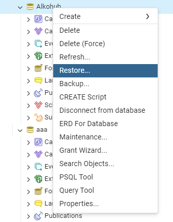

# Database - PostgreSQL

# Installation

## 1. Install PostgreSQL and pgAdmin4
To use this project, you need to isntall PostgreSQL along with pgAdmin4 on your computer. You can download them from the official website: 
[Download PostgreSQL](https://www.postgresql.org/download/)

## 2. Create a Databse and Import Data

Once PostgreSQL is installed, follow these steps:
   1. Open pgAdmin4 and conntect to your PostgreSQL server.
   2. Create a new database
   3. Import the contents of the provided file into the newly created database.

## Need Help?
If you're unsure how to do this, refer to the imgaes provided for guidance.

[If you're all set, continue configuring backend](..)